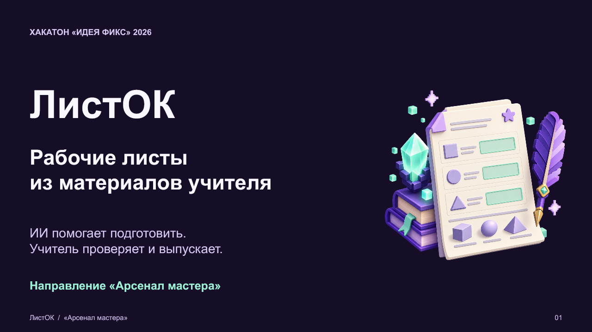

# ЛистОК

**Рабочий лист по материалам учителя: фото заданий, проверка содержания, PDF для печати.**

Конкурсная адаптация проекта [Worksheet Creator](https://github.com/pavelneumoin/worksheet-creator) для хакатона «Идея фикс» 2026. Команда «Код урока», ГБОУ «Школа 2200», Москва. Направление: «Арсенал мастера».

## Для чего нужен проект

Учитель выбирает собственные задания, а сервис помогает распознать их, оформить лист с местом для решения и подготовить отдельные ответы. Педагог проверяет формулировки, формулы и ключи перед использованием на уроке.

Целевая аудитория первого сценария — учителя математики. Промпты и шаблон текущего прототипа ориентированы на математические задачи. Экономию времени и качество материалов предстоит измерить на пилоте.

## Что есть сейчас

В репозитории есть код веб-прототипа и Telegram-бота. В ходе подготовки конкурсной адаптации проверены локальные маршруты интерфейса и API. Полный цикл с действующим ключом ИИ и новой компиляцией PDF в этой проверке не запускался.

| Возможность | Текущий статус |
|---|---|
| Загрузка нескольких фотографий заданий | Реализована в коде |
| Распознавание и подготовка LaTeX через GigaChat-Max | Реализованы вызовы провайдера |
| Редактирование первого варианта перед сборкой | Есть редактор LaTeX |
| Макет A4, 1–6 задач на странице, 1 или 2 колонки | Есть параметры и TeX-шаблон |
| Рабочий лист и отдельный файл ответов | Есть конвейер pdfLaTeX |
| Второй вариант: проще, такой же уровень или сложнее | Есть генерация по исходным заданиям |
| История генераций | Есть локальная SQLite-база |
| Работа через Telegram | Есть отдельный бот |
| Интеграция с MAX и Сферумом | Следующий этап адаптации |
| Конвейер Marp | Не реализован |

Поле загрузки также разрешает PDF, однако в коде нет отдельного PDF-парсера или постраничной подготовки сканов. Для воспроизводимого первого сценария используйте фотографии PNG/JPEG; обработку PDF нужно отдельно подтвердить.

## Сценарий учителя

1. Указать тему, при необходимости имя учителя, число задач на странице и макет.
2. Выбрать фотографии заданий.
3. Проверить распознанный текст и формулы в редакторе LaTeX.
4. Собрать PDF рабочего листа и, если они сформированы, отдельные ответы.
5. Проверить готовый документ и ответы перед печатью.
6. При необходимости создать аналогичный вариант и отдельно проверить его содержание.

Настройка «1–6 задач» задаёт количество на странице. Общее число задач определяется содержимым исходных фотографий.

## Архитектура

Веб-интерфейс и Telegram-бот обращаются к Flask API. Backend отправляет входные файлы в GigaChat-Max, получает тело LaTeX и подставляет его в шаблон A4. Модуль pdfLaTeX собирает лист и ответы. SQLite хранит историю.

| Слой | Реализация |
|---|---|
| Интерфейс | HTML, CSS, JavaScript |
| Сервер | Python, Flask, Flask-CORS |
| ИИ | GigaChat SDK, текущий сценарий с GigaChat-Max |
| Вёрстка | LaTeX, pdfLaTeX, TikZ |
| История | SQLite |
| Существующий бот | pyTelegramBotAPI |
| Контейнер | Dockerfile с Python 3.11 и TeX Live |

Модуль Yandex Vision/YandexGPT сохранён как ранняя альтернативная реализация и не подключён к текущим API-маршрутам.

## Материалы проекта

- [Презентация для жюри](./presentation.pptx)
- [Публичная анкета проекта](./questionnaire-public.docx)
- [Инструкция запуска](./RUN.md)
- [Локальный адаптер](./run_local.py)

## Локальный запуск

Подробные команды, переменные окружения и ограничения: [RUN.md](./RUN.md).

После установки корневых Python-зависимостей и настройки окружения:

~~~bash
python run_local.py
~~~

Откройте [локальный интерфейс](http://127.0.0.1:3005).

Новый локальный адаптер согласует пути frontend и backend, блокирует диагностическую выдачу частей ключа и выключает Flask debugger. Исходное ядро приложения не переписано. Адаптер предназначен для локальной демонстрации.

Для реальной генерации нужны доступ к GigaChat и pdfLaTeX. Если локальный компилятор отсутствует, исходный backend автоматически пытается передать LaTeX внешнему сервису; подробности приведены в RUN.md.

## Адаптация для MAX

План команды:

- подключить загрузку задания и выдачу PDF через бот или мини-приложение MAX;
- сделать проверку содержания учителем единым шагом для обоих вариантов;
- разделить историю и файлы пользователей;
- проверить ошибки ИИ, корректность ответов и устойчивость LaTeX-сборки;
- провести пилот с учителями школы.

Готовый MAX-сервис в текущей версии не заявляется. Существующее ядро обработки файлов можно использовать для нового адаптера.

Технически это мини-приложение MAX для пользователей Сферума: HTTPS-сайт, связанный с ботом, MAX Bridge и серверная проверка данных запуска. Порядок конкурсного доступа предстоит уточнить у организаторов. [Документация MAX](https://dev.max.ru/docs/webapps/introduction).

## Доступ к нейросети

Целевой сценарий — учитель работает без личного API-ключа: доступ к модели и лимиты обслуживает сервер проекта. Техническое подключение через API сохраняется. Партнёрство, бесплатные квоты и источник оплаты пока не подтверждены.

Текущая основа — [GigaChat API](https://developers.sber.ru/docs/ru/gigachat/guides/working-with-files). Альтернативный путь для фото и сканов — [Yandex Vision OCR](https://aistudio.yandex.ru/ru/docs/vision/concepts/ocr/models) и [YandexGPT в Yandex AI Studio](https://aistudio.yandex.ru/ru/docs/ai-studio/concepts/generation/models). Условия доступа к GigaChat для новых клиентов следует сверять с [актуальной инструкцией провайдера](https://developers.sber.ru/docs/ru/gigachat/legal-quickstart).

## Что будем измерять

Сравним ручную подготовку с подготовкой через сервис на одинаковых заданиях. Отдельно зафиксируем время проверки учителем, число исправленных формул и ответов, долю корректно собранных листов и желание использовать инструмент повторно.

Пока нет подтверждённого набора измерений, поэтому проценты точности, гарантированная экономия времени и гарантированная успешность компиляции не приводятся.

## Проверка текущей версии

В локальном адаптере пройдены 11 проверок маршрутов с отключённой внешней сетью и демонстрационным ключом. Проверены загрузка страницы и ресурсов, история, ответы на пустые запросы, блокировка диагностического endpoint и выдача уже существующего PDF. Синтаксический разбор 11 Python-файлов не обнаружил SyntaxError.

Это не проверка качества ИИ, новой TeX-компиляции, Telegram, Docker или MAX. Полные функциональные и нагрузочные тесты запланированы отдельно.

## Структура репозитория

~~~text
app/
  backend/
    app.py
    config.py.example
    templates/default_worksheet.tex
    utils/gigachat_client.py
    utils/latex.py
    utils/db.py
    utils/yandex.py
  frontend/
  Dockerfile
  requirements.txt
bot/
run_local.py
requirements.txt
README.md
RUN.md
~~~

В модальном окне интерфейса можно скопировать тело LaTeX. Для отдельной сборки нужен шаблон с определениями TaskBox и WriteField; это пока не экспорт полного самостоятельного TEX-документа.

## Команда конкурсной адаптации

Все участники учатся в 11 «С» классе ГБОУ «Школа 2200», Москва.

| Участник | Зона ответственности |
|---|---|
| Алексинская Таисия Николаевна | UX/UI и пользовательский сценарий |
| Мазка Дмитрий Валерьевич | ИИ и LaTeX |
| Почкина Анастасия Александровна | Методика и тестирование |
| Скоков Максим Евгеньевич | Капитан ученической команды, backend и MAX |

Педагог-наставник: **Семченков Николай Андреевич**.

## Основа проекта

Worksheet Creator создан Драндровым Максимом Дмитриевичем и Головковым Владимиром Сергеевичем, учащимися 10 «С» класса ГБОУ «Школа 2200», для конференции «Инженеры будущего». Научный руководитель — Неумоин Павел Дмитриевич.

«ЛистОК» — конкурсная адаптация этой основы. Новая команда сохраняет атрибуцию исходного проекта и отдельно описывает свои изменения.

В исходном README указана лицензия MIT. Отдельный LICENSE в полученном снимке отсутствует; его оформление предстоит согласовать с авторами.
