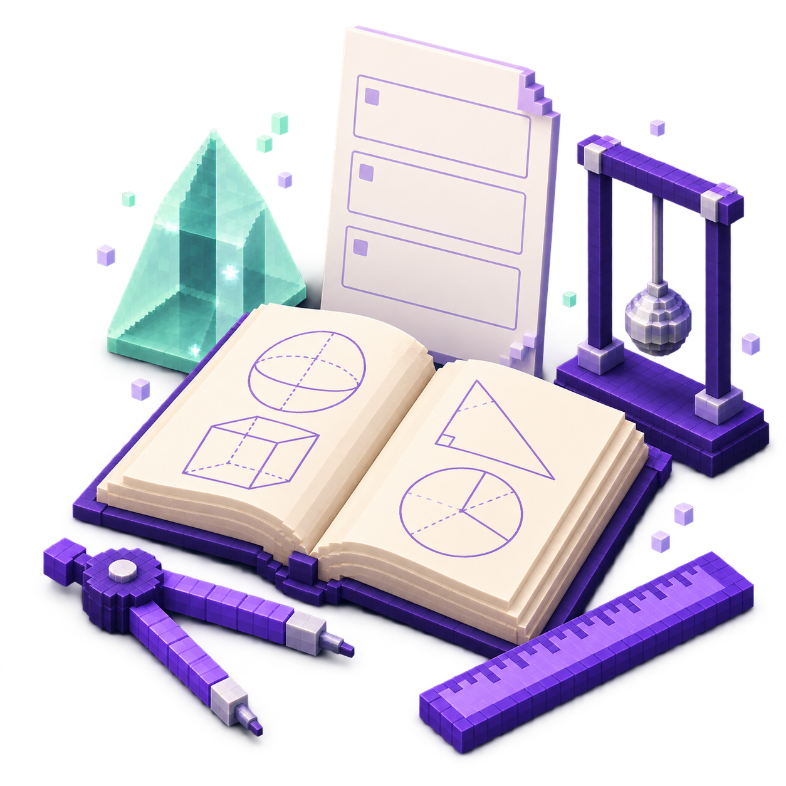
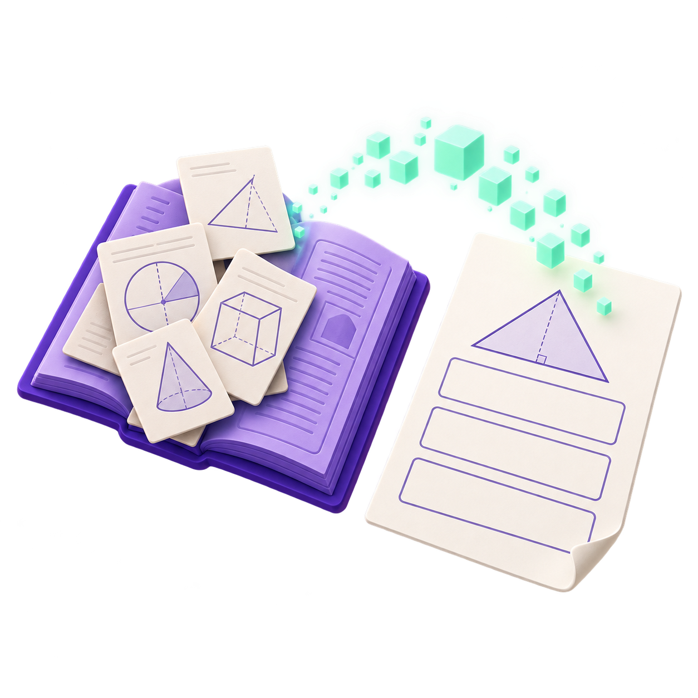
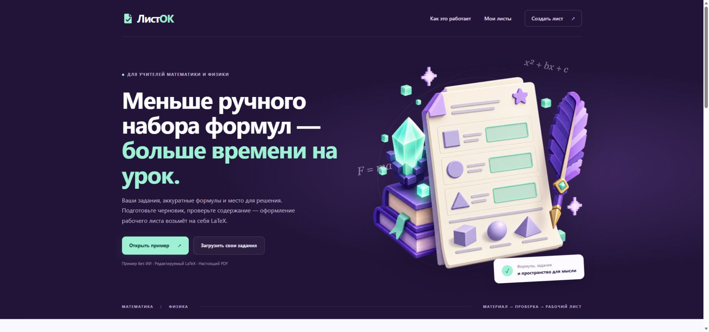
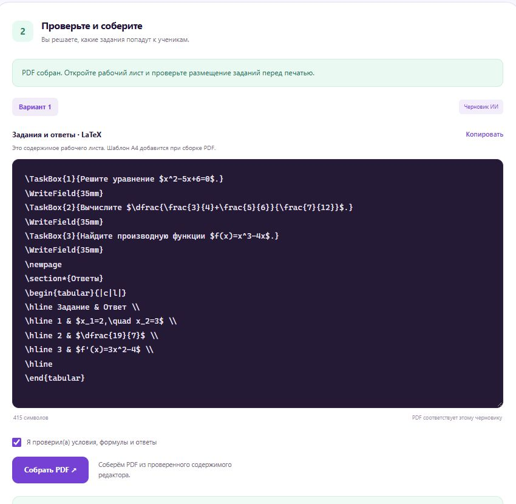
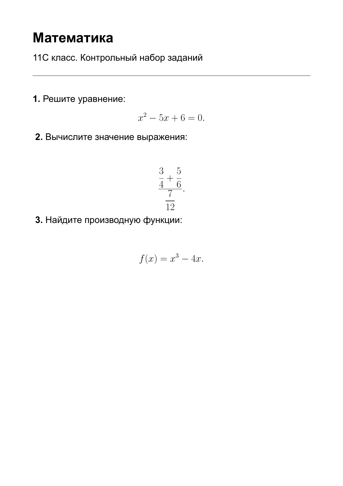
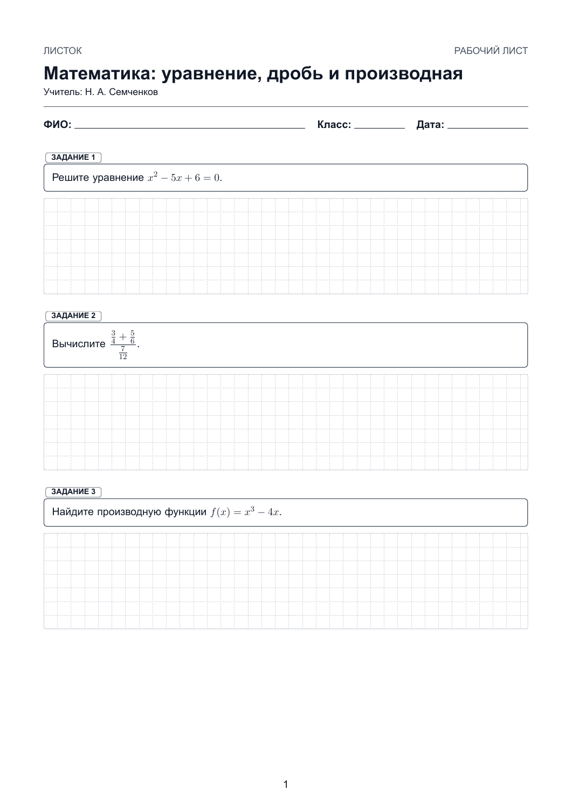
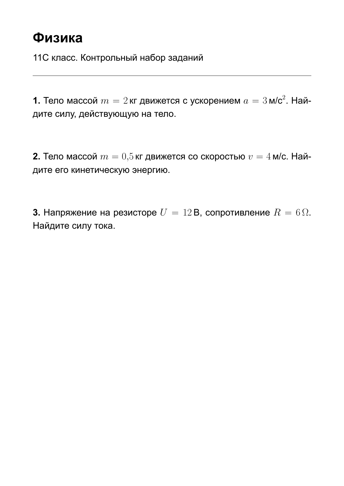
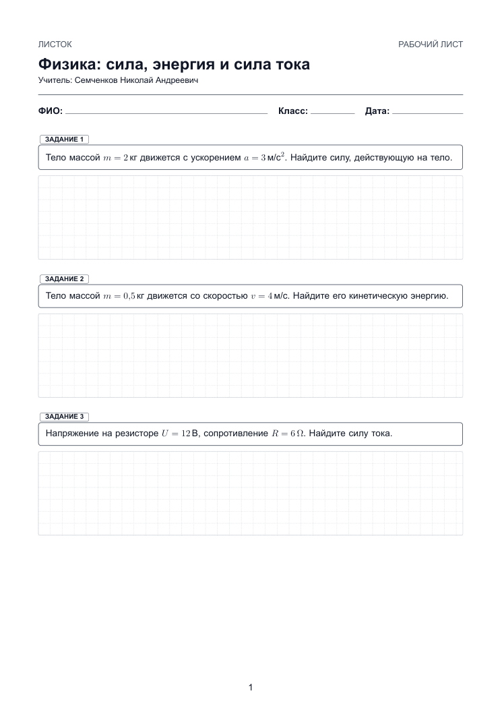

<!-- _class: dark cover -->
<!-- _paginate: false -->

Идея фикс 2026 · Арсенал мастера

<h1>ЛистОК</h1>

Рабочие листы по математике и физике <strong>из ваших заданий</strong>

ИИ готовит черновик. Учитель проверяет. LaTeX оформляет.

Команда «Код урока» 11С класс, ГБОУ «Школа 2200», Москва

<!-- Для проверяющего: направление конкурса — «Арсенал мастера». Готовность: работающий локальный веб-прототип. Интеграция в MAX пока в плане. Иллюстрации созданы с помощью ИИ, это не фотографии команды или событий. -->

---

Команда

<h2>Код урока</h2>

<h3>Скоков Максим Евгеньевич</h3>
Капитан Backend и интеграция MAX

<h3>Алексинская Таисия Николаевна</h3>
Интерфейс и пользовательский сценарий

<h3>Мазка Дмитрий Валерьевич</h3>
ИИ-модуль и оформление LaTeX

<h3>Почкина Анастасия Александровна</h3>
Методика рабочих листов и тестирование

<h3>Семченков Николай Андреевич</h3>
Учитель, наставник команды

Все ученики: 11С класс, ГБОУ «Школа 2200», Москва. Справа — иллюстрация командной работы.

<!-- Данные участников предоставлены пользователем. Роли распределены для конкурсной работы. Использована иллюстрация, а не вымышленные портреты участников. -->

---

Польза

<h2>Формулы усложняют подготовку листа</h2>

<h3>Перенести задания</h3>
Фото, учебник и свои заметки нужно собрать в один материал.

<h3>Набрать формулы в Word</h3>
Дроби, степени, корни и единицы измерения требуют аккуратного ручного ввода.

<h3>Подготовить страницу к печати</h3>
Оставить место для решения, проверить переносы и отдельно оформить ответы.

Сценарий для учителей математики и физики. Масштаб проблемы и экономию времени проверим на пилоте.

<!-- Это описание целевого сценария, а не результат проведённого исследования. Word умеет работать с формулами; мы сокращаем повторный ручной ввод и оформление. -->

---

<!-- _class: dark -->

Удобство

<h2>От задания до рабочего листа</h2>

01
<h3>Загрузить</h3>
Фото заданий в PNG или JPEG.

02
<h3>Подготовить</h3>
GigaChat распознаёт материал и создаёт черновик.

03
<h3>Проверить</h3>
Учитель уточняет условия, формулы и ответы.

04
<h3>Получить PDF</h3>
Лист A4 для учеников и отдельные ответы.

Редактируемый LaTeX сохраняет структуру формул и единое оформление.

<!-- Фактически поддерживаемые входные форматы прототипа: PNG/JPEG. PDF на входе — план. Marp используется для этой презентации; рабочие листы приложение формирует через LaTeX. -->

---

<!-- _class: evidence -->

Работающий прототип

<h2>Интерфейс для подготовки урока</h2>

Реальный снимок локально запущенного ЛистОК. Выбор предмета, загрузка материалов и примеры без ИИ.

<!-- Снимок сделан в Edge во время проверки локального сервера. Это действующее приложение, не макет интерфейса. -->

---

<!-- _class: evidence -->

Контроль учителя

<h2>Черновик можно исправить до печати</h2>

<strong>Формулы остаются редактируемыми.</strong>

Учитель меняет текст задания, ответ и место для решения.

ИИ может ошибаться. Проверка входит в процесс подготовки листа.

Снимок редактора и результата реального запроса к GigaChat 3 Ultra.

<!-- В контрольном прогоне Ultra правильно распознала сложную дробь, но указала неверный ответ. Мы исправили ответ вручную до сборки итогового PDF. -->

---

Математика · реальный результат

<h2>Сложная дробь сохранила свой вид</h2>

<h3>Изображение → PDF</h3>
Уравнение, вложенная дробь и производная.
<math xmlns="http://www.w3.org/1998/Math/MathML" display="block" style="font-size:38px;color:#713cce;margin:24px 0"><mrow><mfrac><mrow><mfrac><mn>3</mn><mn>4</mn></mfrac><mo>+</mo><mfrac><mn>5</mn><mn>6</mn></mfrac></mrow><mfrac><mn>7</mn><mn>12</mn></mfrac></mfrac><mo>=</mo><mfrac><mn>19</mn><mn>7</mn></mfrac></mrow></math>
В первом прогоне ИИ ошибся. Ответ и оформление проверены вручную.

Слева — контрольный материал. В центре — PDF, собранный приложением после проверки содержания.

<!-- Контрольные ответы: корни 2 и 3; значение дроби 19/7; производная 3x²−4. Ошибка ответа ИИ исправлена. Задания подготовлены специально для демонстрации, это не фото чужого учебника. -->

---

Физика · реальный результат

<h2>Формулы и единицы измерения</h2>

<h3>Один лист A4</h3>
Сила, кинетическая энергия и закон Ома.

<strong>F = ma = 6 Н E = mv²/2 = 4 Дж I = U/R = 2 А</strong>

Отдельный PDF с ответами остаётся у учителя.

Реальная генерация GigaChat 3 Ultra и локальная сборка XeLaTeX. Ответы проверены по исходным условиям.

<!-- Контроль: F=ma=6 Н; E=mv²/2=4 Дж; I=U/R=2 А. Входная страница содержит только условия. -->

---

Скорость подготовки

<h2>Автоматизируем набор и оформление</h2>

На демонстрационном наборе из трёх задач:

6,8 с

из изображения в ИИ-черновик

5,6 с

из проверенного LaTeX в PDF

Один локальный прогон по физике, 27.09.2026. Время проверки учителем не включено. Сравнение с Word ещё предстоит.

<!-- Числа взяты из измеренного запроса /api/process и /api/compile. Они не являются средними, гарантией скорости или доказанной экономией времени относительно Word. -->

---

Выбор модели

<h2>GigaChat 3 Ultra в демонстрации</h2>

Для проверки выбрали наиболее мощную доступную модель. Для простых задач предусмотрим более лёгкие варианты.

<table class="models">
<tr><th>Модель</th><th>Роль в сценарии ЛистОК</th></tr>
<tr><td>GigaChat 3 Ultra</td><td>Сложные материалы и формулы. Использована в реальном прогоне.</td></tr>
<tr><td>GigaChat 2 Max</td><td>Альтернатива для сложных инструкций и подготовки заданий.</td></tr>
<tr><td>GigaChat 2 Pro</td><td>Редактирование текста и работа по подробным инструкциям.</td></tr>
<tr><td>GigaChat 2 Lite</td><td>Простые текстовые операции с акцентом на скорость и стоимость.</td></tr>
</table>

Сценарии выбора — проектное решение. Скорость, стоимость и качество моделей между собой пока не измеряли.

<!-- Источники: https://developers.sber.ru/docs/ru/gigachat/models/main и https://developers.sber.ru/docs/ru/gigachat/guides/selecting-a-model . На 27.09.2026 список моделей, доступных данному ключу, также содержит GigaChat-3-Pro и GigaChat-3-Lightning. Это не полная таблица линейки и не сравнительный бенчмарк. Lite в API называется GigaChat-2. -->

---

Реализуемость

<h2>Архитектура уже работает локально</h2>

01 / ИНТЕРФЕЙС<h3>HTML / CSS / JS</h3>
Фото заданий, предмет, редактирование LaTeX.

02 / СЕРВЕР<h3>Python / Flask</h3>
Проверка файлов и обращение к ИИ через API.

03 / ИИ<h3>GigaChat</h3>
Черновик заданий и ответов. Ключ хранится на сервере.

04 / ВЫПУСК<h3>XeLaTeX / PDF</h3>
Лист A4, отдельные ответы и история в SQLite.

Учителю не нужен личный API-ключ.

Для школьного запуска нужны HTTPS, отдельный доступ к истории и изолированная сборка LaTeX.

Текущая версия рассчитана на локальную демонстрацию одним пользователем.

<!-- GigaChat подключён и проверен через API. Секрет хранится в локальной .env, не включён в материалы и репозиторий. Ограничения TeX в прототипе не равны полноценной производственной изоляции. -->

---

<!-- _class: dark -->

Развитие для Сферума

<h2>Мини-приложение MAX</h2>

Учитель открывает ЛистОК из бота MAX, готовит материал и передаёт PDF своему классу.

Следующие шаги: HTTPS-хостинг, MAX Bridge, проверка данных запуска и выдача файлов.

Интеграция ещё не реализована. Партнёрство и бесплатная квота ИИ не подтверждены.

<!-- Корректный термин: мини-приложение MAX для пользователей Сферума. Источники: https://dev.max.ru/docs/webapps и https://www.sferum.ru/hackathon_2026 . Через сервер можно избавить учителя от собственного API-ключа, но само подключение ИИ остаётся API-интеграцией. -->

---

Охват и проверка пользы

<h2>Пилот в ГБОУ «Школа 2200»</h2>

5

учителей

20

рабочих листов

До 100 учеников в расчётном сценарии.

<h3>Что измерим</h3>
Время подготовки с проверкой, число правок в формулах и желание учителя использовать сервис повторно.

Это план пилота, а не фактические пользователи. Подтверждённой статистики спроса и экономии времени пока нет.

<!-- Сравнение должно использовать одинаковые исходные задания. Считать всё время до готового проверенного листа, включая исправления ИИ. Не приписывать сервису улучшение успеваемости без исследования. -->

---

План и ресурсы

<h2>От локального прототипа к пилоту</h2>

НЕДЕЛЯ 1
<h3>Качество</h3>
Набор контрольных формул и воспроизводимый запуск.

НЕДЕЛЯ 2
<h3>Материалы</h3>
Загрузка PDF, обработка сканов и шаблоны двух предметов.

НЕДЕЛЯ 3
<h3>MAX</h3>
Вход, разделение данных и выдача рабочего листа.

НЕДЕЛЯ 4
<h3>Пилот</h3>
Сравнение с ручной подготовкой и доработка по отзывам.

160 человеко-часов — предварительная оценка.

Нужны сервер и хранилище, TeX, квота GigaChat и участие учителей.

Сроки и затраты уточним после пилотных проверок и согласования доступа к MAX.

<!-- Оценка команды: четыре участника, около 40 часов на каждого за четыре недели. Подтверждённого бюджета и соглашений с провайдерами нет. YandexGPT / Yandex Vision OCR рассматриваются как будущая альтернативная интеграция, сейчас используется GigaChat. -->

---

<!-- _class: dark -->

Два аргумента в пользу проекта

<h2>Почему ЛистОК</h2>

01
<h3>Полезен в конкретной работе учителя</h3>
Помогает переносить задания и оформлять сложные формулы в рабочий лист, сохраняя проверку за педагогом.

02
<h3>Основан на работающем прототипе</h3>
Путь от изображения через GigaChat и редактирование LaTeX до PDF уже проверен локально.

<a href="https://github.com/pavelneumoin/worksheet-creator">github.com/pavelneumoin/worksheet-creator</a>

Код, инструкция запуска и материалы проекта доступны по ссылке.

<!-- Итог содержит ровно два аргумента. Критерии этапа: польза, охват, удобство, реализуемость. Источник: положение «Идея фикс 2026», п. 9.6.1 и 10.3, https://www.sferum.ru/hackathon_2026 . -->

---

Материалы для проверяющего

<h2>Готовность проекта и материалы</h2>

<h3>Команда «Код урока»</h3>
Конкурсная версия «ЛистОК»

Рабочие листы для учителей математики и физики. Формулы и задания можно проверить и исправить до печати.

<h3>Демонстрация</h3>
В презентации показаны реальные снимки приложения, исходные задания и PDF после проверки. Измерения времени относятся к одному прогону по физике.

<h3>Проверено</h3>
Реальная генерация по изображениям, редактирование, выпуск PDF и отдельных ответов.

<h3>Предстоит</h3>
MAX, PDF на входе, многопользовательский доступ, изоляция компиляции и пилот с учителями.

<a href="https://github.com/pavelneumoin/worksheet-creator">Код и инструкция запуска</a> <a href="https://developers.sber.ru/docs/ru/gigachat/models/main">Официальная документация GigaChat</a> <a href="https://www.sferum.ru/hackathon_2026">Конкурс «Идея фикс 2026»</a>

Состояние прототипа и результаты демонстрации: 27 сентября 2026 года.

<!-- Приложение к основной истории для самостоятельной проверки жюри. Искусственный интеллект использовался при подготовке иллюстраций и материалов; фактические результаты демонстрации отделены от планов. -->
